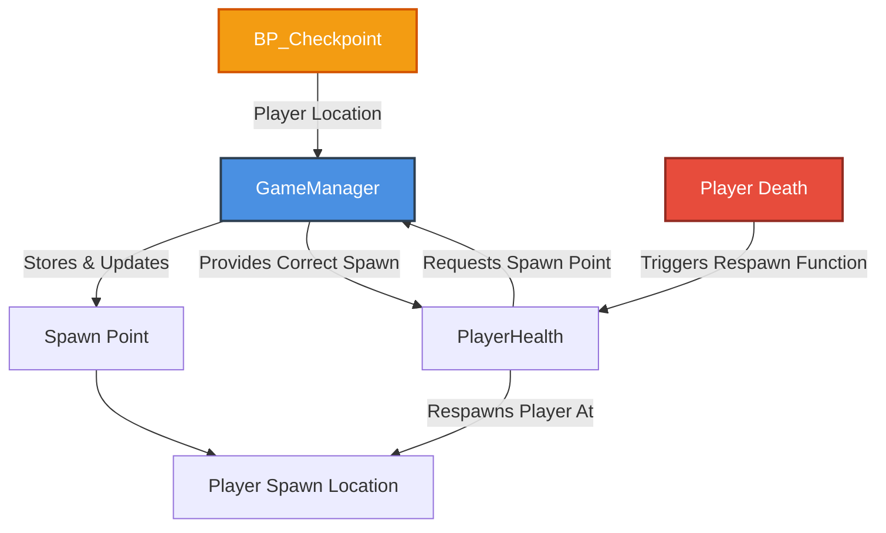

# Project Progression

**Ethan Schledewitz-Edwards**

**Lucas O'Leary**

## Group Formation
When forming our group, we decided to stick to working with other members of our GDW group. This would allow us to contribute to our GDW game, resulting in the time spent working on this project contributing to both this class and the game, rather than having to spend more time working on two separate projects. Working with people from the same GDW team also means that we are already familiar with each other’s strengths and weaknesses, and can efficiently divide up the workload accordingly, as opposed to trying to adapt on the fly.

### Our Projected Timeline

## Interactive Media Scenario
Our interactive media scenario is an extension of our GDW game demo level. This level will utilize all the core mechanics within the game, with an emphasis on the implementations made for this project. As the game is a 3D puzzle platformer that takes place in a grandfather clock, the level will include various clock-related hazards, such as moving platforms, gears, and pitfalls. The level is divided up into smaller sections which focus on a specific mechanic to get through. The level will include UI elements, to showcase the UI-focused implementations, as well as core gameplay elements such as checkpoints and prop spawners to further highlight the implementations made, such as factory and observer. Finally, there will be a toggleable developer console that utilizes commands to trigger events in the scene through text, such as loading a specific checkpoint, or changing game variables, allowing for quicker playtesting and bug fixing.

## Singleton
Our project has implemented the singleton design pattern in two forms: a Game Manager, and a UI Manager.

As with most games, making a game manager was the clear immediate first choice, as it gives a single, central script to handle the overall state of the game. In our scenario, the game manager handles the location of the player’s spawn points as they progress through the level. When the player reaches a checkpoint, the blueprint calls for the spawn point within the game manager to be updated, which in turn allows the respawn function within the player health script to get the correct spawn position from the game manager. 

Having it centralized this way means that there are far less variables to keep track of as opposed to each script containing duplicate variables, or making multiple calls to other scripts to get commonly used values, leading to “spaghetti code”. This streamlines development by keeping the codebase streamlined, comprehensive, and predictable.
