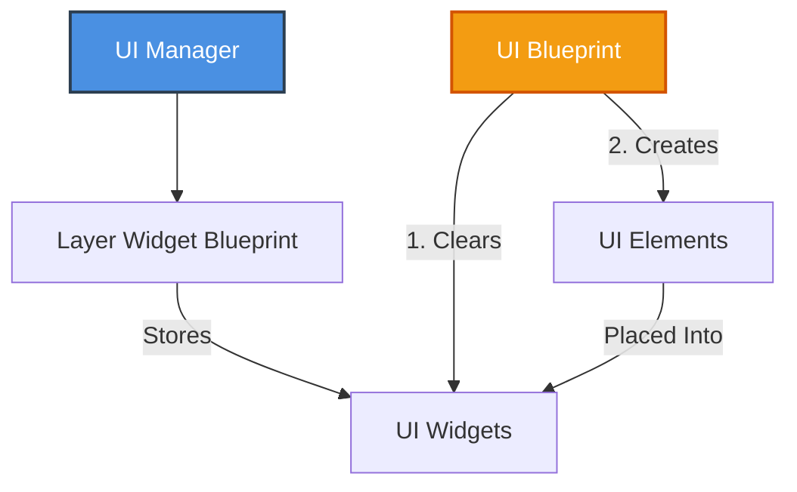
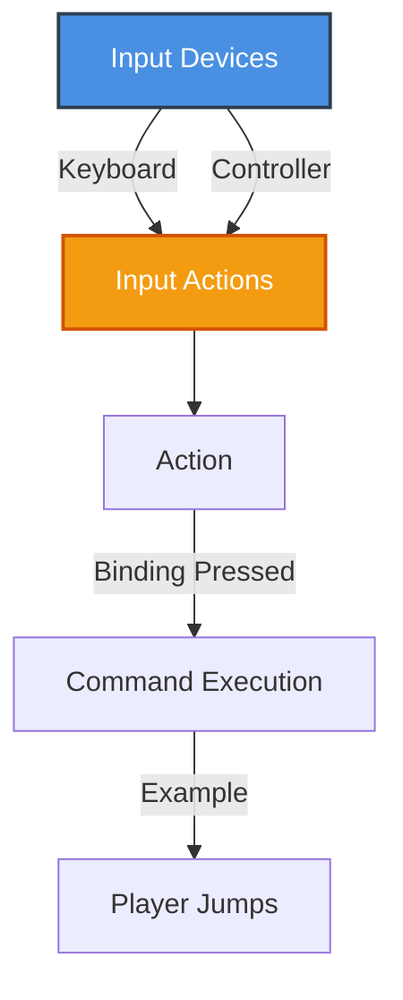
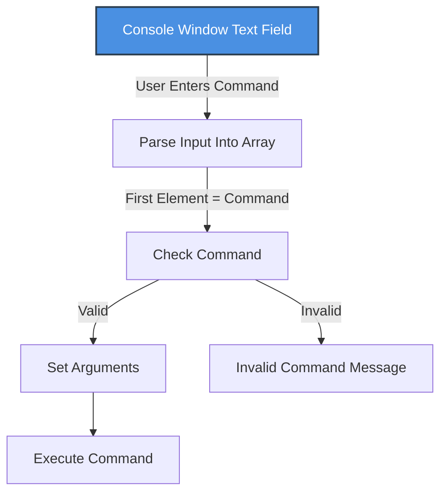
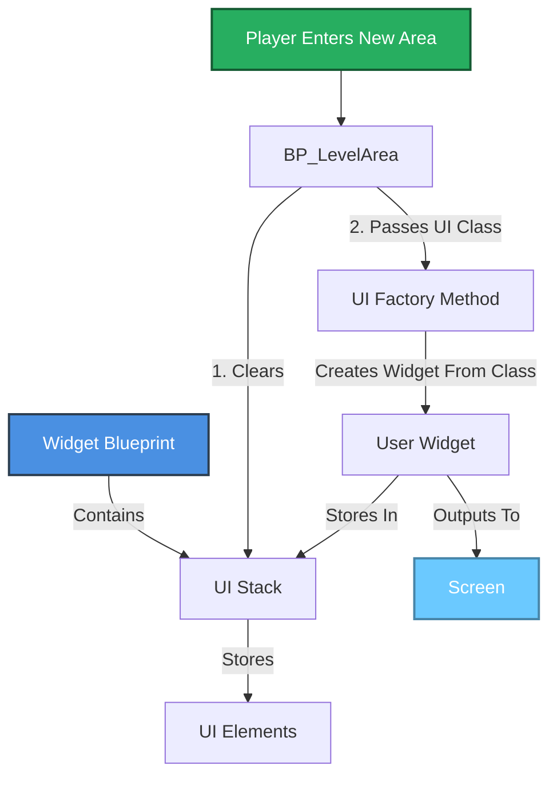

# Project Progression

## **Ethan Schledewitz-Edwards** 100908840 (Programming/Design)

**Contribution: 60%**

I, Ethan Schledewitz-Edwards confirm that my contributions to this project were roughly 60%. I handled the programming and implementation of the features. Additionally, I very lightly supported documentation.

## **Lucas O'Leary** 100790165 (Documentation/Design) 

**Contribution: 40%**

I, Lucas O'Leary, confirm that my contribution to this project is approximately 40%, comprising of the full written documentation of the implemenations, and their supporting flow charts.

## Group Formation
When forming our group, we decided to stick to working with other members of our GDW group. This would allow us to contribute to our GDW game, resulting in the time spent working on this project contributing to both this class and the game, rather than having to spend more time working on two separate projects. Working with people from the same GDW team also means that we are already familiar with each other’s strengths and weaknesses, and can efficiently divide up the workload accordingly, as opposed to trying to adapt on the fly.

### Our Projected Timeline

## Interactive Media Scenario
Our interactive media scenario is an extension of our GDW game demo level. This level will utilize all the core mechanics within the game, with an emphasis on the implementations made for this project. As the game is a 3D puzzle platformer that takes place in a grandfather clock, the level will include various clock-related hazards, such as moving platforms, gears, and pitfalls. The level is divided up into smaller sections which focus on a specific mechanic to get through. The level will include UI elements, to showcase the UI-focused implementations, as well as core gameplay elements such as checkpoints and prop spawners to further highlight the implementations made, such as factory and observer. Finally, there will be a toggleable developer console that utilizes commands to trigger events in the scene through text, such as loading a specific checkpoint, or changing game variables, allowing for quicker playtesting and bug fixing.

## Singleton
Our project has implemented the singleton design pattern in two forms: a Game Manager, and a UI Manager.

As with most games, making a game manager was the clear immediate first choice, as it gives a single, central script to handle the overall state of the game. In our scenario, the game manager handles the location of the player’s spawn points as they progress through the level. When the player reaches a checkpoint, the blueprint calls for the spawn point within the game manager to be updated, which in turn allows the respawn function within the player health script to get the correct spawn position from the game manager. 

The second implementation in our project is the UI manager. This seemed like the next most important one to implement, as our game doesn’t have a health system or combat. The UI manager allows for centralized control for UI elements, by keeping track of the elements within specific layers of the UI by storing them in a stack, allowing for easy clearing of a given layer by blueprints that need to update the UI on the layer. When a blueprint goes to update the UI on a layer, it gets the widget blueprint for that layer, clears its widget stack, then creates new UI widgets, which are placed in the newly cleared layer widget stack. This means that the respective widget stacks can easily be modified by any UI blueprint, as it is all centralized within the UI manager, resulting in easy per-layer UI additions during development.

Having these centralized this way means that there are far less variables to keep track of as opposed to each script containing duplicate variables, or making multiple calls to other scripts to get commonly used values, leading to “spaghetti code”. This streamlines development by keeping the codebase clean, comprehensive, and predictable.

## Command
For the command design pattern, there are two implementations in our project, which are command-based inputs, to allow for easy control binding adjustment, and a console window for text-based command input for testing.

The first command implementation, which is command-based inputs, allows for quick changes to control schemes, as well as support for multiple control schemes at once, such as keyboard and controller. This implementation was done in the form of Unreal’s input action mapping. Each of the controls were given a dedicated action, allowing them to have their individual bindings changed, giving granular control over inputs. It works the same as typical command-based controls, as it listens for specific inputs, then executes a given command, such as jump, when the correct button is pressed. Unreal’s input actions were chosen for this, as they offer a dedicated GUI for editing bindings on actions, which is much quicker when it comes to adjusting bindings during development, especially for those who aren’t programmers.

The second implementation is the console window, which allows users to execute a given command based on what they enter into the text field. For our scenario, this is used to execute a teleportation command, which will teleport the specified actor to the coordinates entered. This works by taking the input in the field, parsing it into an array, then checking if the first element in the array - the command - is a recognized command. It then takes the remaining elements in the array, and executes the command with them as arguments. For the teleportation command, it would look like “/tp Actor X Y Z”, where it calls the teleportation function, and sends the remaining elements as an array for the function to parse and use. This implementation will greatly speed up play testing, as the user can simply teleport to the desired part of the area without having to repeatedly play through the level to get back to the desired part, which would otherwise waste a lot of development time.

## Factory
In terms of the factory design pattern, our project has two implementations in the form of a zone UI generator, which can dynamically create zone-dependent UI elements, and a “prop dropper”, which can spawn various props in our game by dropping them in from above.

The zone UI factory implementation leverages Unreal Engine’s User Widgets to generate UI elements on the screen, regardless of the specifics of the UI. This works by having a widget blueprint for a given UI layer, such as HUD, which then has a stack that stores all the UI elements in that layer. When a player enters a new area, it runs a function in that area’s blueprint - BP_LevelArea - that clears all the elements of the stack in its layer. It then passes its UI class to the UI factory method, which then creates a widget based on the class passed to it, and outputs it onto the screen. This allows for easy expansion in future development, by allowing new zone UI to be created with a single function call, regardless of the specifics of that element. This greatly streamlines the level creation process, reduces redundant UI type checks in the code, and removes the headache of creating new zone UI types in the future.

The second factory implementation, the “prop dropper”, is used to dynamically spawn a given prop in a specific position. In terms of gameplay, this could be something like spawning a gear overhead upon entering a level, which then falls to the ground, and is then used to solve a puzzle. This implementation works by using the blueprint “BP_DynamicObjectSpawner”, which takes the specified transform and object class, and spawns in an actor of that class at the transform. This means that any prop actor class, such as a screw or gear, can be spawned at a specified transform, without needing actor-specific spawn scripts. This, much like the other implementation, means that future development, especially level design, will be more streamlined, and not require the creation of new spawners for every new prop type created.

## Observer
For the observer design pattern, our project has two main implementations, which are trigger zones, which trigger various events upon entry, and UI reactions, which change the UI during a specific event, which in our scenario is the player death.

Our first implementation, trigger zones, is used to control multiple events within our project, such as checkpoints and player death zones. These work by leveraging Unreal’s trigger boxes, and having the blueprints observe the trigger box for overlap. When the trigger box detects that a specific actor has entered the zone, such as the player, the “ActorBeginOverlap” event is run in the given blueprint, either “BP_Checkpoint” or “BP_DeathZone”, which then goes through their respective functions. This implementation is easily expandable, as the zones could be set up to do virtually anything, since the zones will still trigger in the same way regardless of what runs within the “ActorBeginOverlap” event.

The second implementation, UI death reactions, is used to shake the camera when the player dies, adding a bit of dramatic effect on death. This implementation works by having the “PlayerCameraComponent” script observe the death delegate in the “PlayerHealth” script. On death, the health script broadcasts the delegate, which in turn triggers the camera shaking function within the player camera script, causing the screen to shake around. Since the health script broadcasts the delegate on death, it can easily be used to trigger other functions within the game, leading to additional effects being added with little difficulty.

